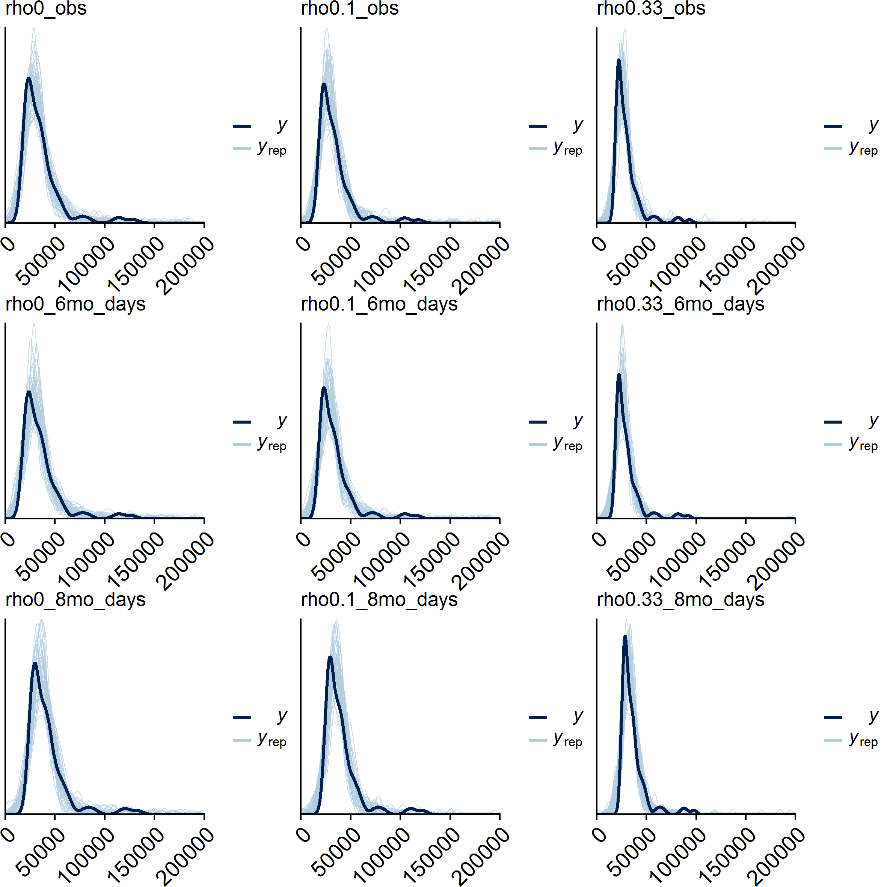

```{r setup, include = TRUE, echo = FALSE}
knitr::opts_chunk$set(echo = FALSE)
knitr::opts_chunk$set(fig.width = 12, fig.height = 8) 
```

```{r}
suppressMessages(library(dplyr))
suppressMessages(library(captioner))
```

## Model

For the amikacin costs $c_0$ and bedaquiline costs $c_1$ the hierarchical model is

$$
log(c_i) \sim t(\mu_c, \sigma^2_c, 4)
$$
$$
\mu_c \sim N(\mu_s, \sigma^2_s)
$$

Vague prior distributions:

$$
\mu_s \sim N(0, 0.000001)
$$

$$
log(\sigma_s) \sim U(-5,10)
$$
$$
\mu_c \sim N(0, 0.000001)
$$

$$
log(\sigma_c) \sim U(-5,10)
$$

## Results

We use a multi-level Bayesian model.
Levels are at patient and centre.
Times and frequencies for injectable treatment are used as baseline (`c0`).


Posterior distributions summary statistics are given below for each scenario.

- `delta_c` is the difference between the two scenarios i.e. `c1 - c0`.
- `thresh` is the exceedance threshold probability that bedaquiline is more costly than amikacin i.e. `c1 - c0 > 0`.
- `m.cX.Y` is the mean cost for intervention `X` at centre `Y`
- `m.centreX` is the overall mean cost for intervention `X`


```{r}
load(here::here("jags", "summary_table.RData"))
print(summary_table)
```


For example, if we scale the bedaquillin hospital length of stay by some 0 < \( \rho \) < 1 and compare with the baseline then the posterior distributions of mean costs are given below.
The red histogram is bedaquiline and the white for injectables.

```{r, out.width = "800px", fig.cap="Mean costs posterior distributions with mean values substituted for missing costs."}
knitr::include_graphics(here::here("plots", "cost-histograms_dt.png"))
```

```{r, out.width = "800px", fig.cap="Difference in mean costs posterior distributions with mean values substituted for missing costs."}
knitr::include_graphics(here::here("plots", "density_strips_dt.png"))
```


### Posterior predictive checking

To check the fit of the model we generate sample of individual-level costs from the posterior distribution and compare with the observed data.

```{r, eval=T, out.width = "1000px", fig.cap="Posterior predictive checks for individual-level amikacin cost data."}

```

```{r, eval=T, out.width = "1000px", fig.cap="Posterior predictive checks for individual-level bedaquiline cost data."}

```


### Cost sensitivity analysis


```{r, eval=F, out.width = "1000px", fig.cap="Mean costs posterior distributions with mean values substituted for missing costs."}
knitr::include_graphics("../plots/mean_costs_posteriors_mean-missing.png")
```

```{r, eval=F, out.width = "1000px", fig.cap="Mean costs posterior distributions with minimum values substituted for missing costs."}
knitr::include_graphics("../plots/mean_costs_posteriors_min-missing.png")
```


```{r, eval=F, out.width = "1000px", fig.cap="Mean costs posterior distributions with maximum values substituted for missing costs."}
knitr::include_graphics("../plots/mean_costs_posteriors_max-missing.png")
```


### Between centre costs

At the centre level, if we focus on the baseline scenario `c_0` then the posterior mean distributions on cost for each centre are:

```{r, eval=F, out.width = "500px", fig.cap=""}

```


