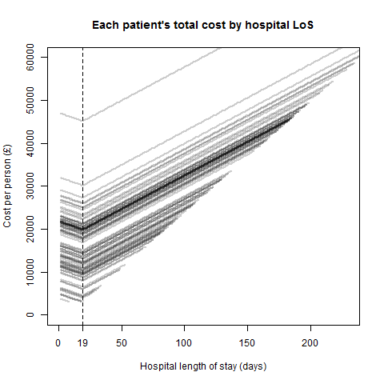

This document gives some of the methods and data of the initial part of the analysis for circulation.

## Look-up costs

The cost have been obtained from 4 centres.
They are not complete at time of writing.
I have therefore crudely used the minimum, maximum and mean value across observed values in centres.

Also, hospital stay costs are scaled from 4\% to 24\% for different centre.
Baseline values are fixed \£2429 for stays under 20 days and \£208 for each day thereafter.

The raw, and minimum, mean and maximum imputed cost matrices are:


 centre_costid   centre_patientid   bed_under20d   bed_over20d   PICC   hick   OPAT   blood_amak   blood_liver   blood_renal   hear   ECG   scaling
--------------  -----------------  -------------  ------------  -----  -----  -----  -----------  ------------  ------------  -----  ----  --------
             1                  1       3016.089      258.2736     69      0    102         7.50          3.80          3.19    0.0   153    1.2417
             2                  4       2945.162      252.2000     NA     NA    148         7.50          2.65          1.62     NA    25    1.2125
             3                  2       2538.062      217.3392     NA     NA    100           NA            NA            NA   33.0   124    1.0449
             4                  3       2962.408      253.6768    200    200     NA        29.56         11.82          9.45   34.5    15    1.2196

Table  1: Original data


 centre_costid   centre_patientid   bed_under20d   bed_over20d   PICC   hick   OPAT   blood_amak   blood_liver   blood_renal   hear   ECG   scaling
--------------  -----------------  -------------  ------------  -----  -----  -----  -----------  ------------  ------------  -----  ----  --------
             1                  1        3016.09        258.27     69      0    102         7.50          3.80          3.19    0.0   153      1.24
             2                  4        2945.16        252.20     69      0    148         7.50          2.65          1.62    0.0    25      1.21
             3                  2        2538.06        217.34     69      0    100         7.50          2.65          1.62   33.0   124      1.04
             4                  3        2962.41        253.68    200    200    100        29.56         11.82          9.45   34.5    15      1.22

Table  2: Fill with minimum values


 centre_costid   centre_patientid   bed_under20d   bed_over20d    PICC   hick     OPAT   blood_amak   blood_liver   blood_renal   hear   ECG   scaling
--------------  -----------------  -------------  ------------  ------  -----  -------  -----------  ------------  ------------  -----  ----  --------
             1                  1        3016.09        258.27    69.0      0   102.00         7.50          3.80          3.19    0.0   153      1.24
             2                  4        2945.16        252.20   134.5    100   148.00         7.50          2.65          1.62   22.5    25      1.21
             3                  2        2538.06        217.34   134.5    100   100.00        14.85          6.09          4.75   33.0   124      1.04
             4                  3        2962.41        253.68   200.0    200   116.67        29.56         11.82          9.45   34.5    15      1.22

Table  3: Fill with mean values


 centre_costid   centre_patientid   bed_under20d   bed_over20d   PICC   hick   OPAT   blood_amak   blood_liver   blood_renal   hear   ECG   scaling
--------------  -----------------  -------------  ------------  -----  -----  -----  -----------  ------------  ------------  -----  ----  --------
             1                  1        3016.09        258.27     69      0    102         7.50          3.80          3.19    0.0   153      1.24
             2                  4        2945.16        252.20    200    200    148         7.50          2.65          1.62   34.5    25      1.21
             3                  2        2538.06        217.34    200    200    100        29.56         11.82          9.45   33.0   124      1.04
             4                  3        2962.41        253.68    200    200    148        29.56         11.82          9.45   34.5    15      1.22

Table  4: Fill with maximum values


- `bed_under20d` is cost of hosptial stay fixed up to 19 days
- `bed_over20d` is the daily cost of hospital stay for every day over 19 days
- `PICC` is the cost of a PICC line
- `hick` is the cost of a Hickman line
- `blood amik` is the cost of a blood test
- `blood liver` is the cost of a blood test
- `blood renal` is the cost of a blood test
- `hear` is the cost of a hearing test
- `ECG` is the cost of an ECG
- `scaling` is the centre specific cost scaling

Note that the provided cost and patient data do not use the same ids (represented here by `centre_costid` and `centre_patientid`).

The total cost of bedaquiline treatment is \£18000 for a duration of 24 weeks.
The idealised duration of amikacin treatment is 24  or 32 weeks.
Therefore, we scale the bedaquiline cost for an equivalent 32 weeks period of \£ 24000 too.


## Scenarios

Cost are considered for 12 main scenarios.
These can be grouped in to observed injection vs ideal injection  scenarios, and observed injection vs tablets scenarios.
For the comparison bedaquiline scenarios hospital length of stay is scaled by a predefined value to represent shorter symptom duration.


No. | Baseline        | Comparison
--- | --------------- | ---------------
1a  | Amikacin injection observed | Bedaquiline tablets 6 months; same hospital length of stay 
1b  | Amikacin injection observed | Bedaquiline tablets 6 months; 90\% hospital length of stay 
1c  | Amikacin injection observed | Bedaquiline tablets 6 months; 66\% hospital length of stay 
    |
2a  | Amikacin injection ideal 6 months | Bedaquiline tablets 6 months; same hospital length of stay 
2b  | Amikacin injection ideal 6 months | Bedaquiline tablets 6 months; 90\% hospital length of stay 
2c  | Amikacin injection ideal 6 months | Bedaquiline tablets 6 months; 66\% hospital length of stay 
    |
3a  | Amikacin injection ideal 8 months | Bedaquiline tablets 8 months; same hospital length of stay 
3b  | Amikacin injection ideal 8 months | Bedaquiline tablets 8 months; 90\% hospital length of stay 
3c  | Amikacin injection ideal 8 months | Bedaquiline tablets 8 months; 66\% hospital length of stay 

So, for each set of costs (minimum, mean, maximum) and each treatment scenario, in total there are 9 x 3 = 27 scenarios to consider.


## Patient-level cost calculation

The costs for each scenario consist of the following:

#### Observed and idealised injectable
* Time in hospital (from observed data)
* OPAT daily in discharge period (observed, up to 6 or 8 months)
* Number of lines (Hickman, PICC) in discharge period (observed, up to 6 or 8 months)
* Number of monthly hearing tests in discharge period (observed, up to 6 or 8 months)
* Number of weekly blood tests (observed, up to 6 or 8 months)

#### Bedaquiline
* Time in hospital from observed data (possible scaled downwards)
* Monthly ECG and blood tests (renal, LFT) in discharge period (up to 6 or 8 months)
* Total fixed cost of treatment (up to 6 or 8 months)


### Estimated number of events
For the idealised scenarios we need to estimate how many Hickman and PICC lines would occur for each individual in the fixed period.
We do this by estimating a pooled weekly rate for each from the total sample.
We then calculate each according to their duration on treatment after hospital discharge.


### Patient time to event equations

Initial hospital length of stay
$$
t_{adm}=d_{hosp\_end}-d_{IV\_start}
$$

Out-patient (OP) duration
$$
t_{OP}= \left\{
\begin{array}{ll}
d_{IV\_end}-d_{hosp\_end} \;\; \text{for observed scenarios}\\
t_{Tx} - t_{adm} \;\; \text{for non-observed scenarios}
\end{array}
\right.
$$
where
$$
t_{Tx} = 24, 32
$$

Total hospital length of stay including readmissions
$$
t_{adm}^{inj}=t_{adm}+t_{readm}
$$

Total hospital length of stay for bedaquiline
$$
t_{adm}^{bdq}=\rho t_{adm}+t_{readm}, \; \; 0\le\rho\le1
$$

Total out-patient duration for amikacin 
$$
t_{OP}^{inj}=\max{\left\{t_{OP}-t_{readm}, 0\right\}}
$$

Total out-patient duration for bedaquiline
$$
t_{OP}^{bdq}=\max{\left\{t_{OP}-t_{readm}+(1-\rho)t_{adm},0\right\}}
$$

Estimated number of Hickman and PICC lines
$$
\hat{n}_{hick} = t_{OP}^{inj} \frac{\sum n_{hick}}{\sum t_{OP}^{inj}}, \;\; \hat{n}_{PICC} = t_{OP}^{inj} \frac{\sum n_{PICC}}{\sum t_{OP}^{inj}} 
$$


### Total cost equations

* Bedaquiline tablets

$$
c_{bdq}^i=\left[c_{bed<20}+\max{\left\{t_{adm}^{bdq}-19,0\right\}}c_{bed>20}\right]+\left\lfloor\frac{t_{OP}^{bdq}}{7}\right\rfloor\left(c_{ECG}+c_{renal}+c_{liver}\right)+c_{bdq}
$$

* Observed injectible amikacin

$$
c_{amik}^i=\left[c_{bed<20}+\max{\left\{t_{adm}^{inj}-19,0\right\}}c_{bed>20}\right]+c_{hick}n_{hick}^i+c_{PICC}n_{PICC}^i+c_{OP}t_{OP}^i+c_{hear}n_{hear}^i
$$

* Ideal injectible amikacin

$$
c_{amik,ideal}^i=\left[c_{bed<20}+\max{\left\{t_{adm}^{inj}-19,0\right\}}c_{bed>20}\right]+c_{hick}\hat{n}_{hick}^i+c_{PICC}\hat{n}_{PICC}^i+c_{OPAT}\hat{t}^{i}_{OP}+c_{hear}\hat{n}_{hear}^i
$$


## Patient-level data

Each patient's cost is calculated using the costs for their particular site.
Their times to events and counts are available (`obs`).
The analysis data thus consist of the original recorded data, the derived coutns and times and the total cost per patient.

For each scenario the summary costs are given below.


```

                                 Min.   1st Qu.   Median          Mean     3rd Qu.       Max.   NA's
------------------------------  -----  --------  -------  ------------  ----------  ---------  -----
X1                                  1      24.5       49    49.7894737    74.50000   100.0000      1
studynum                            1      24.5       49    49.7894737    74.50000   100.0000      1
centre_patientid                    1       2.0        3     2.7157895     4.00000     4.0000      1
admission                           0       1.0        1     0.9368421     1.00000     1.0000      0
num_hearing_tests                   0       1.0        3     4.0421053     6.00000    13.0000      0
num_Ak_trough_levels                0       0.0       10    10.3473684    18.50000    59.0000      0
num_picc_line                       0       1.0        1     0.9894737     1.00000     3.0000      0
num_hickman_line                    0       0.0        0     0.0947368     0.00000     2.0000      0
readmission_line_complication       0       0.0        0     0.0526316     0.00000     1.0000      0
readmissions_days                   0       0.0        0     0.6000000     0.00000    31.0000      0
num_line_complication               0       0.0        0     0.3052632     0.00000     3.0000      0
OPAT_weeks_obs                      0       0.0       13    15.7229474    21.57000   128.4300      0
OPAT_days_inj                       0       0.0       91   109.5789474   149.50000   899.0000      0
OPAT_weeks_inj                      0       0.0       13    15.6541353    21.35714   128.4286      0
OP_days_bdq                         0       0.0       91   109.5789474   149.50000   899.0000      0

                                 Min.   1st Qu.   Median          Mean     3rd Qu.       Max.   NA's
------------------------------  -----  --------  -------  ------------  ----------  ---------  -----
X1                                1.0     24.50     49.0    49.7894737    74.50000   100.0000    1.0
studynum                          1.0     24.50     49.0    49.7894737    74.50000   100.0000    1.0
centre_patientid                  1.0      2.00      3.0     2.7157895     4.00000     4.0000    1.0
admission                         0.0      1.00      1.0     0.9368421     1.00000     1.0000    0.0
num_hearing_tests                 0.0      1.00      3.0     4.0421053     6.00000    13.0000    0.0
num_Ak_trough_levels              0.0      0.00     10.0    10.3473684    18.50000    59.0000    0.0
num_picc_line                     0.0      1.00      1.0     0.9894737     1.00000     3.0000    0.0
num_hickman_line                  0.0      0.00      0.0     0.0947368     0.00000     2.0000    0.0
readmission_line_complication     0.0      0.00      0.0     0.0526316     0.00000     1.0000    0.0
readmissions_days                 0.0      0.00      0.0     0.6000000     0.00000    31.0000    0.0
num_line_complication             0.0      0.00      0.0     0.3052632     0.00000     3.0000    0.0
OPAT_weeks_obs                    0.0      0.00     13.0    15.7229474    21.57000   128.4300    0.0
OPAT_days_inj                     0.0      0.00     91.0   109.5789474   149.50000   899.0000    0.0
OPAT_weeks_inj                    0.0      0.00     13.0    15.6541353    21.35714   128.4286    0.0
OP_days_bdq                       1.6     23.45     98.3   117.0115789   152.85000   916.1000    1.6

                                 Min.   1st Qu.   Median          Mean     3rd Qu.       Max.   NA's
------------------------------  -----  --------  -------  ------------  ----------  ---------  -----
X1                               1.00     24.50       49    49.7894737    74.50000   100.0000   1.00
studynum                         1.00     24.50       49    49.7894737    74.50000   100.0000   1.00
centre_patientid                 1.00      2.00        3     2.7157895     4.00000     4.0000   1.00
admission                        0.00      1.00        1     0.9368421     1.00000     1.0000   0.00
num_hearing_tests                0.00      1.00        3     4.0421053     6.00000    13.0000   0.00
num_Ak_trough_levels             0.00      0.00       10    10.3473684    18.50000    59.0000   0.00
num_picc_line                    0.00      1.00        1     0.9894737     1.00000     3.0000   0.00
num_hickman_line                 0.00      0.00        0     0.0947368     0.00000     2.0000   0.00
readmission_line_complication    0.00      0.00        0     0.0526316     0.00000     1.0000   0.00
readmissions_days                0.00      0.00        0     0.6000000     0.00000    31.0000   0.00
num_line_complication            0.00      0.00        0     0.3052632     0.00000     3.0000   0.00
OPAT_weeks_obs                   0.00      0.00       13    15.7229474    21.57000   128.4300   0.00
OPAT_days_inj                    0.00      0.00       91   109.5789474   149.50000   899.0000   0.00
OPAT_weeks_inj                   0.00      0.00       13    15.6541353    21.35714   128.4286   0.00
OP_days_bdq                      5.28     49.94      118   134.1066316   159.56000   955.4300   5.28

                                 Min.    1st Qu.      Median          Mean     3rd Qu.     Max.   NA's
------------------------------  -----  ---------  ----------  ------------  ----------  -------  -----
X1                                  1   24.50000    49.00000    49.7894737    74.50000   100.00      1
studynum                            1   24.50000    49.00000    49.7894737    74.50000   100.00      1
centre_patientid                    1    2.00000     3.00000     2.7157895     4.00000     4.00      1
admission                           0    1.00000     1.00000     0.9368421     1.00000     1.00      0
num_hearing_tests                   0    3.00000     4.00000     3.9473684     6.00000     6.00      0
num_Ak_trough_levels                0    0.00000    10.00000    10.3473684    18.50000    59.00      0
num_picc_line                       0    0.68500     0.96000     0.9330526     1.37500     1.51      0
num_hickman_line                    0    0.06500     0.09000     0.0887368     0.13000     0.14      0
readmission_line_complication       0    0.00000     0.00000     0.0526316     0.00000     1.00      0
readmissions_days                   0    0.00000     0.00000     0.6000000     0.00000    31.00      0
num_line_complication               0    0.00000     0.00000     0.3052632     0.00000     3.00      0
OPAT_weeks_obs                      0    0.00000    13.00000    15.7229474    21.57000   128.43      0
OPAT_days_inj                       0   76.00000   107.00000   103.7789474   152.50000   168.00      0
OPAT_weeks_inj                      0   10.85714    15.28571    14.8255639    21.78571    24.00      0
OP_days_bdq                         0   76.00000   107.00000   103.7789474   152.50000   168.00      0

                                 Min.    1st Qu.      Median          Mean     3rd Qu.     Max.   NA's
------------------------------  -----  ---------  ----------  ------------  ----------  -------  -----
X1                                1.0   24.50000    49.00000    49.7894737    74.50000   100.00    1.0
studynum                          1.0   24.50000    49.00000    49.7894737    74.50000   100.00    1.0
centre_patientid                  1.0    2.00000     3.00000     2.7157895     4.00000     4.00    1.0
admission                         0.0    1.00000     1.00000     0.9368421     1.00000     1.00    0.0
num_hearing_tests                 0.0    3.00000     4.00000     3.9473684     6.00000     6.00    0.0
num_Ak_trough_levels              0.0    0.00000    10.00000    10.3473684    18.50000    59.00    0.0
num_picc_line                     0.0    0.68500     0.96000     0.9330526     1.37500     1.51    0.0
num_hickman_line                  0.0    0.06500     0.09000     0.0887368     0.13000     0.14    0.0
readmission_line_complication     0.0    0.00000     0.00000     0.0526316     0.00000     1.00    0.0
readmissions_days                 0.0    0.00000     0.00000     0.6000000     0.00000    31.00    0.0
num_line_complication             0.0    0.00000     0.00000     0.3052632     0.00000     3.00    0.0
OPAT_weeks_obs                    0.0    0.00000    13.00000    15.7229474    21.57000   128.43    0.0
OPAT_days_inj                     0.0   76.00000   107.00000   103.7789474   152.50000   168.00    0.0
OPAT_weeks_inj                    0.0   10.85714    15.28571    14.8255639    21.78571    24.00    0.0
OP_days_bdq                      17.1   85.20000   113.10000   111.2115789   154.05000   168.00   17.1

                                  Min.     1st Qu.      Median          Mean     3rd Qu.     Max.    NA's
------------------------------  ------  ----------  ----------  ------------  ----------  -------  ------
X1                                1.00    24.50000    49.00000    49.7894737    74.50000   100.00    1.00
studynum                          1.00    24.50000    49.00000    49.7894737    74.50000   100.00    1.00
centre_patientid                  1.00     2.00000     3.00000     2.7157895     4.00000     4.00    1.00
admission                         0.00     1.00000     1.00000     0.9368421     1.00000     1.00    0.00
num_hearing_tests                 0.00     3.00000     4.00000     3.9473684     6.00000     6.00    0.00
num_Ak_trough_levels              0.00     0.00000    10.00000    10.3473684    18.50000    59.00    0.00
num_picc_line                     0.00     0.68500     0.96000     0.9330526     1.37500     1.51    0.00
num_hickman_line                  0.00     0.06500     0.09000     0.0887368     0.13000     0.14    0.00
readmission_line_complication     0.00     0.00000     0.00000     0.0526316     0.00000     1.00    0.00
readmissions_days                 0.00     0.00000     0.00000     0.6000000     0.00000    31.00    0.00
num_line_complication             0.00     0.00000     0.00000     0.3052632     0.00000     3.00    0.00
OPAT_weeks_obs                    0.00     0.00000    13.00000    15.7229474    21.57000   128.43    0.00
OPAT_days_inj                     0.00    76.00000   107.00000   103.7789474   152.50000   168.00    0.00
OPAT_weeks_inj                    0.00    10.85714    15.28571    14.8255639    21.78571    24.00    0.00
OP_days_bdq                      56.43   107.70000   128.47000   128.3066316   158.62000   168.96   56.43

                                 Min.     1st Qu.      Median          Mean     3rd Qu.     Max.   NA's
------------------------------  -----  ----------  ----------  ------------  ----------  -------  -----
X1                                  1    24.50000    49.00000    49.7894737    74.50000   100.00      1
studynum                            1    24.50000    49.00000    49.7894737    74.50000   100.00      1
centre_patientid                    1     2.00000     3.00000     2.7157895     4.00000     4.00      1
admission                           0     1.00000     1.00000     0.9368421     1.00000     1.00      0
num_hearing_tests                   0     5.00000     6.00000     5.8210526     8.00000     8.00      0
num_Ak_trough_levels                0     0.00000    10.00000    10.3473684    18.50000    59.00      0
num_picc_line                       0     1.18500     1.47000     1.4040000     1.87500     2.01      0
num_hickman_line                    0     0.11500     0.14000     0.1347368     0.18000     0.19      0
readmission_line_complication       0     0.00000     0.00000     0.0526316     0.00000     1.00      0
readmissions_days                   0     0.00000     0.00000     0.6000000     0.00000    31.00      0
num_line_complication               0     0.00000     0.00000     0.3052632     0.00000     3.00      0
OPAT_weeks_obs                      0     0.00000    13.00000    15.7229474    21.57000   128.43      0
OPAT_days_inj                       0   132.00000   163.00000   156.2105263   208.50000   224.00      0
OPAT_weeks_inj                      0    18.85714    23.28571    22.3157895    29.78571    32.00      0
OP_days_bdq                         0   132.00000   163.00000   156.2105263   208.50000   224.00      0

                                 Min.     1st Qu.      Median          Mean     3rd Qu.     Max.   NA's
------------------------------  -----  ----------  ----------  ------------  ----------  -------  -----
X1                                1.0    24.50000    49.00000    49.7894737    74.50000   100.00    1.0
studynum                          1.0    24.50000    49.00000    49.7894737    74.50000   100.00    1.0
centre_patientid                  1.0     2.00000     3.00000     2.7157895     4.00000     4.00    1.0
admission                         0.0     1.00000     1.00000     0.9368421     1.00000     1.00    0.0
num_hearing_tests                 0.0     5.00000     6.00000     5.8210526     8.00000     8.00    0.0
num_Ak_trough_levels              0.0     0.00000    10.00000    10.3473684    18.50000    59.00    0.0
num_picc_line                     0.0     1.18500     1.47000     1.4040000     1.87500     2.01    0.0
num_hickman_line                  0.0     0.11500     0.14000     0.1347368     0.18000     0.19    0.0
readmission_line_complication     0.0     0.00000     0.00000     0.0526316     0.00000     1.00    0.0
readmissions_days                 0.0     0.00000     0.00000     0.6000000     0.00000    31.00    0.0
num_line_complication             0.0     0.00000     0.00000     0.3052632     0.00000     3.00    0.0
OPAT_weeks_obs                    0.0     0.00000    13.00000    15.7229474    21.57000   128.43    0.0
OPAT_days_inj                     0.0   132.00000   163.00000   156.2105263   208.50000   224.00    0.0
OPAT_weeks_inj                    0.0    18.85714    23.28571    22.3157895    29.78571    32.00    0.0
OP_days_bdq                      22.4   141.20000   169.10000   163.6431579   210.05000   224.00   22.4

                                  Min.     1st Qu.      Median          Mean     3rd Qu.     Max.    NA's
------------------------------  ------  ----------  ----------  ------------  ----------  -------  ------
X1                                1.00    24.50000    49.00000    49.7894737    74.50000   100.00    1.00
studynum                          1.00    24.50000    49.00000    49.7894737    74.50000   100.00    1.00
centre_patientid                  1.00     2.00000     3.00000     2.7157895     4.00000     4.00    1.00
admission                         0.00     1.00000     1.00000     0.9368421     1.00000     1.00    0.00
num_hearing_tests                 0.00     5.00000     6.00000     5.8210526     8.00000     8.00    0.00
num_Ak_trough_levels              0.00     0.00000    10.00000    10.3473684    18.50000    59.00    0.00
num_picc_line                     0.00     1.18500     1.47000     1.4040000     1.87500     2.01    0.00
num_hickman_line                  0.00     0.11500     0.14000     0.1347368     0.18000     0.19    0.00
readmission_line_complication     0.00     0.00000     0.00000     0.0526316     0.00000     1.00    0.00
readmissions_days                 0.00     0.00000     0.00000     0.6000000     0.00000    31.00    0.00
num_line_complication             0.00     0.00000     0.00000     0.3052632     0.00000     3.00    0.00
OPAT_weeks_obs                    0.00     0.00000    13.00000    15.7229474    21.57000   128.43    0.00
OPAT_days_inj                     0.00   132.00000   163.00000   156.2105263   208.50000   224.00    0.00
OPAT_weeks_inj                    0.00    18.85714    23.28571    22.3157895    29.78571    32.00    0.00
OP_days_bdq                      73.92   162.36000   183.13000   180.7382105   213.61500   224.00   73.92
```


<div class="figure">

<p class="caption">Patient total costs by hospital length of stay for amikacin treatment. Blue and red lines are for 8 and 6 week regimens respectively.</p>
</div>

